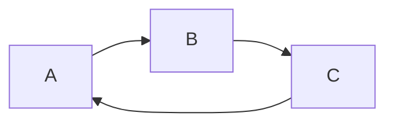

### Motivation
最近玩了一下Jekyll，感觉还挺有意思的，所以建了个博客和个人主页。规划以后发的博客内容主要围绕技术分享和一些相关的个人经历，但不排除有一天突发奇想会发点别的。其实是用来push自己好好学习和总结(bushi。

### Note
By the way，现在的博客主要是参考各路大佬的代码拼接而成的，因为我发现好多模板要不就是功能太全，但是整个项目代码量太大，而且不太flexible，不容易定制化一些自己想要的功能；要不就是过于朴素，没啥功能，新手想加功能还得重新捣鼓很久。所以立个flag，后面找时间整理一下代码，出一个易维护且易用的模板。

Thanks!

try:

$f(x) = sin(x) + 12$

