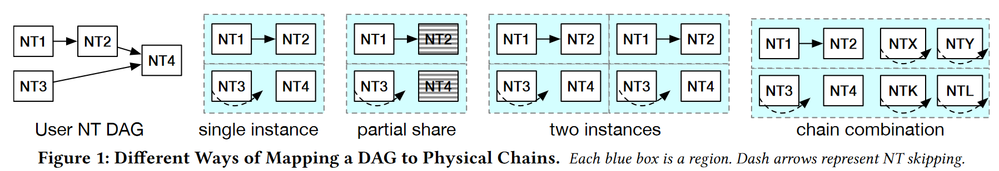
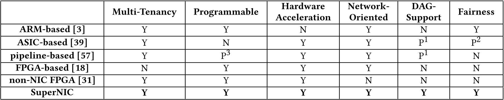
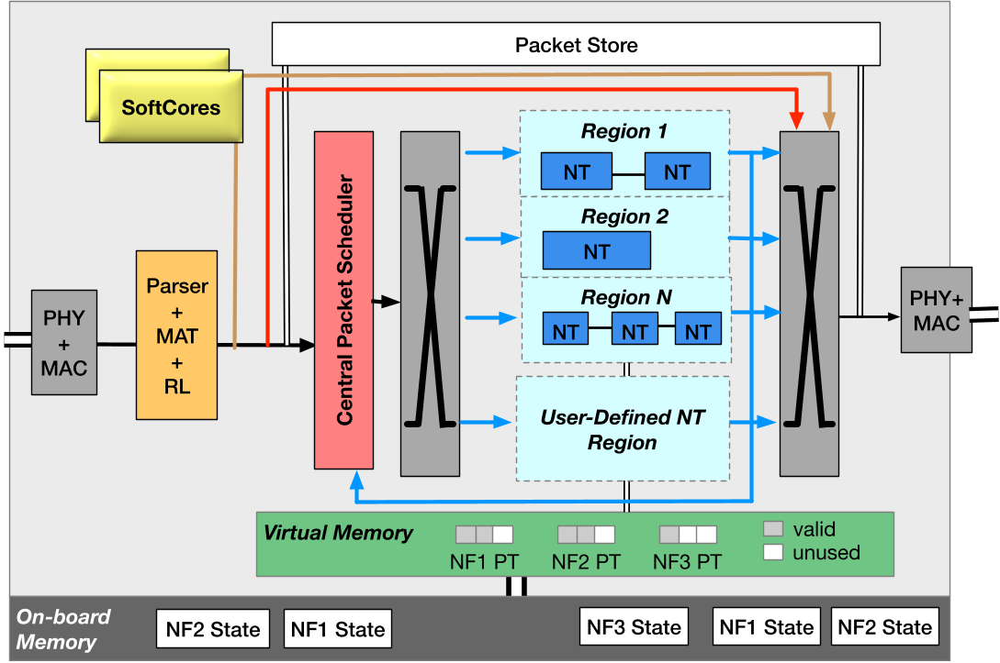
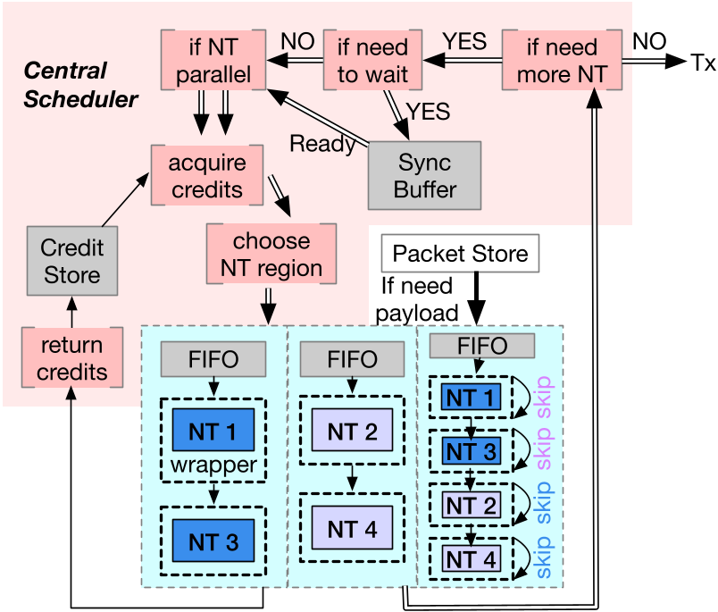

## Motivation

VLSI设计导论课程要求阅读并翻译解析一篇System领域的文献，正好我也有开一个专栏记录本人文献阅读笔记的想法，遂一拍即合诞生了本篇blog。

---

## 摘要

随着当今数据中心的 CPU 扩展速度减慢，越来越多的功能从 CPU 卸载到辅助设备。SmartNIC就是这样一种设备，它越来越多地被数据中心采用。在当今的云环境中，同一服务器上的虚拟机可以有自己的网络计算（或网络任务）或网络任务的工作流，以卸载到 SmartNIC。这些网络任务可以在 VM 来来去去时动态添加/删除，并且可以在 VM 之间共享。这种动态性要求 SmartNIC 不仅要调度和处理数据包，还要管理和执行不同用户的卸载网络任务。尽管存在操作系统等软件解决方案用于管理基于软件的网络任务，但这种基于软件的 SmartNIC 无法跟上快速增长的数据中心网络速度。

本文提出了一种新的SmartNIC平台，称为**SuperNIC**，该平台允许多个租户高效、安全地卸载基于FPGA的网络计算DAG。为了提高效率和可扩展性，本文的核心思想是将网络任务分组到虚拟链中，这些虚拟链根据负载和 FPGA 空间可用性动态映射到不同形式的物理链。本文还进一步提出了具有不同类型并行性自动扩展网络任务链的技术。此外，本文提出了一种公平共享机制，该机制既考虑了不同类型硬件资源的公平空间共享，也考虑了公平时间共享。本文的SuperNIC的FPGA原型实现了高带宽和低延迟性能，同时有效地利用和公平共享资源。

## 引言

数据中心网络最近出现了三个趋势：

1. 随着摩尔定律和Denard’s Scaling[16]的放缓，**更多的网络功能从CPU卸载到RDMA NIC等网络设备**。计算卸载不仅受益于数据中心的网络基础设施功能，还受益于云用户的网络计算需求。
2. 除了固定逻辑网络功能外，对卸载特定于应用进程的**定制功能的需求也越来越大**[12,27,37,42]，特别是对于云用户。
3. **数据中心的网络速度正在快速提高**。如今，40 Gbps 和 100 Gbps 已成为常态，200 Gbps [43] 可用，400 Gbps [44] 即将到来。

这些趋势要求基于硬件的可编程 SmartNIC 能够适应数据中心工作负载和云环境。在未来SmartNIC的潜在候选者中，FPGA因其在硬件速度下的可编程性以及在数据中心和云中的广泛采用而脱颖而出[6,7,18,50]。然而，尽管 FPGA 在数据中心中被广泛使用，并且在公共云中作为服务提供，但目前还没有在云环境中提供网络可编程性的解决方案。

在云环境中在基于 FPGA 的 SmartNIC 上实现网络可编程性具有多种意义：

1. 网络任务由流中的数据包以流方式触发，这使得现有的针对通用计算的FPGA解决方案不可用，因为这种计算是由租户应用进程的一个输入触发的，并在计算后返回一个结果。
2. 在多个租户共享服务器的云环境中，必须在租户之间高效、公平地共享基于 FPGA 的 SmartNIC。在基于软件或基于 ASIC 的 SmartNIC 上工作的现有多租户解决方案无法直接应用于基于 FPGA 的 SmartNIC，因为它们不适用于可重新配置的硬件资源。
3. 由于网络流量（即流量大小和到达速率）的巨大变化以及频繁的租户进出，云设置会导致显着的动态性[9,48]。在这样的环境中，能够快速适应负载变化并频繁切换卸载网络任务的 SmartNIC 至关重要。

本文介绍了 **sNIC （SuperNIC）**，这是一种基于 FPGA 的 SmartNIC，可在动态的多租户环境中提供网络可编程性。sNIC 包括用于执行用户卸载网络计算的 FPGA、用于接收、调度和发送数据包的固定系统逻辑的 ASIC，以及用于执行控制平面任务（如策略实施）的软件内核。支持卸载经典网络功能（例如，传输层、防火墙、加密）以及特定于应用进程的计算（例如，键值存储操作 [27， 37]、实时分析 [27] 和无服务器/微服务功能 [12， 42]）。与传统上部署在FPGA上的通用加速器计算不同，用户的网络计算通常由一系列较小的任务（例如防火墙、加密）组成。许多此类网络任务在租户中很常见，可以由云提供商或第三方提供。基于这些观察结果，本文将 sNIC 的用户界面设计为网络任务（即 NT）的 DAG（有向无环图），用户在发送指定给 DAG 的网络流之前将其部署到 sNIC。NT 可以被认为是软件中的**微服务**，但它们是 FPGA 网表。

在sNIC的设计中，本文解决了一个关键的研究问题：**如何在动态的多租户环境中在FPGA上启动和执行卸载的NT？**

本文解决这个问题的方法围绕着本文引入的一个新抽象：**虚拟网络任务链**，或为简洁起见的**NT链**。虚拟 NT 链是用户定义的 NT DAG 的一部分，由顺序 NT 组成。 根据网络负载和 FPGA 空间可用性，一个虚拟链可以映射到并行运行的物理链的多个实例、带宽与其他租户共享的部分物理链或几个较小的物理链， 每个租户都是其他租户较长链的一部分，如图 1 所示。

要实现 NT 链，首先需要一个能够高效处理大量租户的 NT 计算需求的板架构。以前的工作[39]将每个网络计算单元（在我们的抽象中为NT）连接到一个不能很好地扩展的横杆。为了减少横杆所需的端口数量并实现更具可扩展性的电路板架构，我们建议将横杆连接到固定且数量相对较少的FPGA区域，每个区域托管一个物理NT链。横杆的另一端是 sNIC 的数据包调度器，它接收传入的数据包并将其分派到指定区域。我们设计了数据包调度机制，以最大程度地减少通过调度进程的数据包的延迟开销，并增强调度进程的可扩展性。

在这种板架构下，虚拟NT链的朴素实现将涉及将其映射到一个区域中的物理链。但是，这样做可能会导致较小的虚拟 NT 链浪费区域空间，或导致无法执行较大的虚拟 NT 链。为了更好地利用FPGA资源，我们提出了一个基于数据包类型跳过链中NT的功能，方法是为每个NT添加一个包装器。 NT跳过使我们能够将多个小型虚拟NT链连接到一个长物理链中来填充一个区域： 当一个流只访问长物理链的一部分时， 它可以跳过剩余的 NT。我们还可以将虚拟链拆分为多个较小的物理链，每个物理链都适合一个区域。此外，我们可以通过跳过 NT（例如 B）来允许租户部分共享另一个租户使用的 NT 链（例如，A → B → C 中的 A → C）。总之，这些技术支持使用横杆连接到的更大区域和更少区域，同时最大限度地提高租户之间的 FPGA 空间利用率。

为了在动态负载下提供性能，我们利用了两种类型的NT链并行性。第一种类型通过将多个虚拟NT链作为并行物理链执行来探索NT DAG内部的并行性，从而缩短NT DAG的总执行时间。第二种类型通过创建整个 NT DAG 或 DAG 内较小的虚拟链的多个并行物理实例来提高整体数据包执行吞吐量。我们根据网络流量负载、资源可用性和用户获得的资源的适当份额来确定 NT DAG 的并行度（即缩放）量。

最后，为了最大限度地利用 sNIC，我们支持多种类型的资源共享，包括 FPGA 芯片的空间共享、NT 链的带宽共享以及通过多个 NT 链之间的上下文切换来共享 FPGA 区域的时间共享。为了最大限度地降低上下文切换的性能开销，我们提出了几种技术来隐藏FPGA部分重配置的开销。此外，在执行上述类型的共享时，sNIC 需要确保租户之间的公平性。传统的公平性解决方案只考虑空间或分时。我们提出了一项政策，以适应性和细粒度的方式共同考虑公平的空间和时间共享。

我们使用 100 Gbps HTG-9200 板 [1] 对带有 FPGA 的 sNIC 数据平面进行原型设计。我们在软件中模拟公平性（缩放）策略。我们构建或移植了三种类型的 12 个 NT，以便在 sNIC 上运行：可靠的传输、防火墙和加密等传统网络功能，以及特定于应用进程的任务，如键值数据复制和缓存。我们使用微观和宏观基准评估了 sNIC，并将 sNIC 与 PANIC [39] 进行了比较，PANIC 是一种支持基于 ASIC 和基于 CPU 卸载的多租户 SmartNIC。我们的结果表明，sNIC 提供 100 Gbps 的吞吐量，调度开销仅为 196 ns。我们真实的 NT-DAG 实验表明，与 PANIC 相比，我们基于 NT-DAG 的调度系统可以在很大程度上减小横杆尺寸，同时将 NT-DAG 延迟降低多达 40%。此外，sNIC 将每个 FPGA 面积的性能提高了 2.81 倍，sNIC 实现了比以前的工作高达 3.83 倍的总利用率，同时保证了公平性。

## 动机及相关工作

### 数据中心的网络任务卸载

虽然 CPU 的频率扩展速度正在减慢，但网络速度却以更快的速度增长。如今，大多数数据中心都以40 Gbps或100 Gbps的速度运行[21,38]。很快，200 Gbps [43] 和 400 Gbps [44] 网络将到来。因此，软件网络堆栈的 CPU 消耗变得越来越高。网络堆栈往往会占用 30-40% 的 CPU 周期 [8]。因此，更多的网络功能正在从 CPU 卸载到各种网络设备。例如，RDMA NIC 在硬件中执行传输层，并允许完全绕过 CPU。
除了网络堆栈之外，当今的数据中心用户还需要执行其他更高级别的网络任务：

- 第一类任务是**传统的网络问题**，如数据包调度[53]、拥塞控制[51]和负载均衡[45]。
- 第二大类是**特定于应用进程的计算**，如加速共识[36]、存储[24,25]、数据库[32,35,61]和机器学习[49]。

在云环境中，物理机可以托管数百甚至数千个（轻量级）虚拟机或容器，每个虚拟机或容器都有自己的网络卸载需求。随着云计算不断采用更轻量级的虚拟化环境，我们预计这种需求在未来会进一步增长。这些应用进程趋势要求 SmartNIC 能够支持多租户和用户定义的计算卸载，而网络速度趋势则要求卸载计算的硬件加速。总之，它们证明了对像sNIC这样的设备的需求。

### 现有的 SmartNIC 解决方案

SmartNIC 是可以执行某些计算的 NIC。根据提供计算能力的硬件，SmartNIC 可分为四种类型：

1. 第一种是**基于ARM的SmartNIC**，它们运行类似Linux的操作系统，在ARM处理器上托管用户软件进程[3,34]。软件很灵活，但无法满足当今 100 Gbps 或更高线路速率的高处理速度需求 [15]。
2. 第二种类型是**基于ASIC的SmartNIC**，它包括专门的网络功能加速器，如AES、压缩、正则表达式匹配和流量控制/过滤，用户可以选择这些加速器来处理他们的数据包。尽管 ASIC 通常提供出色的性能，但它们仅提供固定的功能集，无法满足希望卸载自定义功能的用户的需求。此外，ASIC 使迭代已部署网络功能的版本和更新变得困难且成本高昂。由于ASIC的限制，许多最近的SmartNIC将通用处理器与ASIC加速器相结合[2,3,46]。例如，NVIDIA BlueField SmartNIC [3] 使用通用内核和多个固定逻辑网络功能加速器以及 RDMA NIC 来支持网络处理卸载。虽然仅使用固定逻辑加速器时，BlueField可以实现高吞吐量，但当添加软件卸载时，性能会急剧下降[40]。
3. 第三种类型是**基于网络特定管道的 SmartNIC**，允许用户在固定的数据包处理管道上编程。例如，Menshen [57] 允许在由可重新配置的匹配和操作表组成的管道上实现多租户可编程性。这种类型的SmartNIC的主要限制是其有限的可编程性，例如，有限的操作类型，完成数据包处理的有限数量的阶段等。
4. 最后一种是**基于FPGA的SmartNIC**。与基于软件或基于ASIC的SmartNIC不同，基于FPGA的SmartNIC介于软件易于编程但处理速度有限和ASIC的全硬件速度但固定逻辑功能不灵活之间。与基于软件的解决方案相比，FPGA 能够提供数量级的速度提升，同时保持灵活性，但代价是编程难度。由于这一优势，并且随着FPGA开发工具链的成熟，基于FPGA的SmartNIC已经在Microsoft内部大规模部署[18]。但是，Microsoft基于FPGA的SmartNIC用于内部基础设施，因此它们没有多租户或云支持。

在之前的所有SmartNIC解决方案中，PANIC [39]与sNIC最相关。PANIC 是一个 SmartNIC 平台，可为多个租户计划和执行网络功能链。PANIC 和 sNIC 之间有四个主要区别：

1. 首先，PANIC的设计是针对固定逻辑网络功能加速器和基于CPU的计算单元。相比之下，sNIC专为基于FPGA的SmartNIC而设计，解决了与FPGA重新配置和空间共享相关的独特挑战。
2. 其次，PANIC 不适应动态流量或不允许 NT 更改。它专注于将数据包调度到静态 ASIC/软件 NT，sNIC 可适应流量和 NT 更改。
3. 第三，PANIC 没有 sNIC 的虚拟 NT 链抽象，而是将所有网络功能单元直接连接到横杆上，从而产生空间和/或性能开销和可扩展性限制。
4. 最后，与 sNIC 不同，PANIC 只有原始公平性支持（例如，加权公平队列），不处理不同资源的公平空间和时间分配。

### 通用多租户 FPGA 解决方案

随着 FPGA 的日益普及，人们提出了为多个租户提供虚拟化、隔离环境的解决方案，以执行通用计算加速（即非网络目标）。

第一种共享机制是**时间多路复用**，其中整个FPGA芯片在一段时间内专用于一个租户，然后重新配置为下一个租户提供服务。AWS F1 [50]、阿里云 [7] 和腾讯云 [55] 等当今的云 FPGA 服务都采用了这种方法。这种机制的主要问题是大多数租户只使用 FPGA 的一小部分，而剩余的 FPGA 资源被浪费了。

第二种类型是**空间共享**，其中不同租户的应用进程在FPGA芯片的不同部分上运行。大多数空间共享FPGA解决方案将物理FPGA划分为固定大小的区域，每个区域专门分配给一个应用[10,11,17,29,31,58]。另一种方法以AmorphOS[28]的高吞吐量模式为例，该模式在编译时将多个FPGA应用打包在一起，然后将其调度到动态大小的区域上。ViTAL [59]采用的另一种方法是将FPGA应用进程编译并分解为一组固定大小的块，每个块都可以自由映射到FPGA中任何均匀化、固定大小的ViTAL切片上。

尽管这些先前的工作提出了各种解决方案来共享时间和空间共享FPGA，但它们并不针对网络使用，并且在很大程度上与sNIC正交。sNIC 是一种多租户 SmartNIC，可自定义用于执行网络任务 DAG 的 FPGA。除了通过上下文切换进行空间共享和分时外，sNIC 还允许多个租户安全地共享同一 NT 的带宽。我们进一步提出了不同类型的NT并行和自动缩放技术，以及一种新的公平性算法，旨在在基于FPGA的SmartNIC中公平共享NT。

## 使用说明与板子预览

在深入研究 sNIC 的详细设计之前，本节首先概述了 sNIC、如何使用它、其高级架构以及数据包通过 sNIC 所采用的路径。

### 使用 SuperNIC

要使用 sNIC，用户需要将 NT 部署为网表，方法是从云提供商或第三方获取 NT，或者自己编写和生成 NT 网表。我们假设所有云提供商提供的 NT 都可以在用户之间共享，并具有 sNIC 的性能和内存隔离保证。用户还可以指定他们愿意共享的其他 NT。我们希望共享 NT 的用户不要相互信任，而是信任云提供商和 sNIC。

部署 NT 后，用户可以指定一个或多个用户编写或编译器生成的 [33， 54] 个已部署 NT 的 DAG。 与传统的 NT 执行流不同，传统 NT 只按顺序执行 NT，我们允许多个 NT 并行执行。sNIC 将用户指定的 DAG 存储在其内存中，并为 dag 中的每个 NT 分配一个唯一 ID （UID）。在运行时，每个数据包都带有一个 UID，sNIC 使用它将数据包定向到相应的 FPGA 区域。

最后，除了 NT DAG 之外，用户还为每个 NT DAG 提供所需的入口带宽。在云设置中，可以采用与当今云要求用户指定 VM 大小的方式相同的方式查看此所需的入口带宽。我们的公平性算法将保证所有用户至少获得他们想要的入口带宽（§ 4.5）。

### 板子架构与数据包流

下图显示了 sNIC 板的高层架构。sNIC的数据平面处理所有数据包处理。它由用于运行 NT 的可重构硬件 （FPGA）（下图中的蓝色部分）和少量用于非 NT 系统堆栈的不可重构硬件 （ASIC） 组成，包括入口和出口网络堆栈和解析器/解析器、中央数据包调度器、NT 使用的虚拟内存系统以及全局数据包存储。sNIC 的控制平面负责动态配置 NT 和 sNIC 本身，以及执行 PR。它作为软件在一小组通用内核（简称 SoftCore）（例如，基于 ARM 的小型 SoC）上运行。

当数据包到达 RX 端口时，它会经过标准的物理可靠链路层。目前，我们对每个数据包使用用户提供的数据包描述符来描述每个数据包应运行哪些 NT。解析器为每个数据包创建一个数据包描述符，并将其附加到其标头。描述符包含用于存储元数据的字段，例如 NT DAG UID。

数据平面数据包有效负载将发送到数据包存储。它们的标头转到中央数据包调度进程。调度进程确定何时以及哪些 NT 将提供数据包，并相应地发送数据包。NT 链完成后，如果要执行的 NT 更多，则数据包将发送回调度进程以开始另一轮调度。完成所有 NT 后，数据包将发送到 TX 端口。

## SuperNIC 设计

在设计 sNIC 时，一个关键且独特的挑战是在多租户环境中执行基于硬件的 NT 的空间和性能效率。此外，我们的目标是一个动态环境，在这个环境中，不仅应用进程的负载，而且应用进程本身都可能不时发生变化。因此，与专注于数据包处理和数据包调度的传统 SmartNIC 不同，sNIC 还需要高效调度 NT。我们设计 sNIC 可同时实现几个关键目标：

1. 目标一：一个系统堆栈(非 NT 部件),可以线速处理数据包。
2. 目标二：高吞吐量、低延迟的 NT DAG 执行。
3. 目标三：快速适应工作量的变化。
4. 目标四：高效利用板上的硬件资源。
5. 目标五：安全和公平地共享所有板上资源。

本节首先讨论 sNIC 如何组织、部署、启动、自动缩放和并行化 NT。然后，我们将讨论 sNIC 如何调度数据包、确保公平性并使 NT 能够通过虚拟内存系统访问内存。

### NT 链和 NT 区域

随着数据中心应用规模的快速增长，单机计算资源增长缓慢，不可避免地会有更多的数据通过网络，更多的计算将被卸载到网络设备。与通用计算不同，网络计算的类型（即NT）通常在用户之间是通用的，并且每个网络任务都较小，或者可以通过微服务方式分解为更小的部分。因此，我们预计部署 NT DAG 的需求会增加，其中许多 DAG 具有公共部件。

基于上述观察结果，我们提出了一个虚拟 NT 链的基本管理和部署单元——作为用户定义的 NT DAG 一部分的 NT 的顺串行表，如图 2 所示。我们探索了设计这些链的不同方式，以优化吞吐量、延迟和空间。目前，我们允许用户提供实体NT链。编译器可能会自动执行从用户 DAG 到物理链的映射，我们将其开发留给未来的工作。

每个物理链都放置在一个FPGA NT区域中，该区域可以通过FPGA部分重配置（PR）独立重新编程[41]。我们将中央调度进程和所有 NT 区域连接到横杆的两侧。通过链接NT并允许共享完整或部分物理链，与之前将每个NT连接到横杆的工作相比，我们可以大大减少横杆的端口数量[39]。这有助于降低 sNIC （G4） 的硬件复杂性和面积成本。

**NT 跳过**。为了进一步提高 FPGA 空间利用率 （G4），我们的想法是允许跳过物理链中的任意 NT（图 3）。为了实现跳过，我们在 DAG 中的每个 NT 周围添加包装器逻辑，这决定了数据包是发送到 NT 还是跳过到下一个 NT 的包装器。包装器根据调度进程根据用户指定的 NT DAG 插入的数据包标头字段做出此决定。

NT跳跃支持在sNIC中进行两种设计，这两种设计都是为了提高资源利用率。

1. 第一种设计是在租户之间共享部分物理链，这些租户可能具有与其 NT DAG 重叠的已部署 NT 链的不同部分。例如，在图 4 中，在部署 DAG-b 时，sNIC 可以通过跳过 DAG-a 链中的 NT1 和 NT3 来直接使用这些链中的 NT2 和 NT4。
2. 第二种设计是将多个虚拟NT链组合成一个区域内更长的物理链。由于区域大小可以大于任何用户 NT 链，因此能够形成比任何虚拟链都长的物理链可以最好地利用区域中的所有空间。例如，在图 3 中，用户 A 的链 A （NT1− →NT3） 与用户 B 的链 B （NT2− →NT4） 在一个区域中连接，用户 A 的数据包跳过链 B，用户 B 的数据包跳过链 A。

**NT 区域大小**。由于在启动 FPGA 之前需要预先确定用于 PR 的 FPGA 区域，因此还需要预先配置区域大小。由于我们支持提供商/第三方提供的 NT（即已知的 NT）和用户定义的 NT（其大小未知），因此我们还支持两种类型的区域。我们对已知的 NT 区域使用固定但可配置的大小，并将大多数横杆端口专用于它们。我们将剩余的端口和剩余的 FPGA 空间用于用户定义的 NT 区域。已知 NT 区域的大小应至少能够适合最大的已知 NT，并且可以根据 FPGA 大小而更大。目前，我们对所有已知的 NT 区域都使用固定大小。之前的FPGA工作已经提出将FPGA拆分为不同的尺寸[28]。我们将采用这种技术留给未来的工作。

### NT 流水线和并行性

在执行 NT DAG 时，我们利用了各种形式的流水线和并行性，如图 4 所示。首先，我们通过将 NT 的物理链划分为单独的 NT 级，并在执行完毕后将新数据包发送到给定的级，如图 4 的 S1 所示。在 S1 中，两个 DAG 共享一个链（扁平化的 DAG-a），要执行 DAG-b，将跳过 NT1 和 NT3。其次，我们在 DAG 中执行并行路径作为单独的物理链，这些物理链可以并行运行，以减少处理数据包所需的总时间（我们称之为 DAG 并行性）。我们提供了一个轻量级的拆分器NT，它通过复制数据包将相同的数据包发送到parralel中的不同NT。例如，为了减少 DAG-a 的执行时间，我们可以并行运行 NT1− →NT2 和 NT3，就像在 S2 中一样，这将 DAG-a 的执行时间从 4 个单元减少到 3 个单元。请注意，执行 NT3 后，数据包将进入同步 NT，该同步 NT 在执行 NT4 （§4.4） 之前等待 NT1− →NT2 完成。最后，我们创建同一虚拟 NT 链的多个物理实例，以进一步提高数据包处理吞吐量（我们称之为实例并行性）。调度进程以循环方式将不同的数据包发送到 NT DAG 的并行实例 （§4.4）。例如，我们在 S3 中创建两个 NT1− →NT2 实例和两个 NT4 实例，以提高 S2 的整体吞吐量。

我们动态计算给定物理链的目标并行量的建议。根据对 NT DAG 的请求负载以及我们分配给用户的公平份额 （§4.5），我们的策略会建议哪些 DAG（或 DAG 的子集）可以纵向扩展或缩减。这里的数字不一定是整数，可以小于 1，因为 NT 可以由多个用户共享（例如，图 4 中的 NT2 和 NT4），并且可以将多条链放置在一个区域中。

### NT 部署

用户提前向 sNIC 平台提供 NT 作为 FPGA 网表，并指定他们想要的这些 NT 的 DAG（虚拟链）。如果 DAG 包含用户定义的 NT，则将其放置在用户定义的 NT 区域中。用户为其物理链的各种配置提供FPGA比特流。每个 NT 都使用一个小型 sNIC 封装器（图 3）来监控 NT 的运行时负载 （§4.5），确保 PR 期间的信号完整性，并为 NT 提供一组虚拟接口以访问其他板资源，如板载内存。在上述过程中，如果我们发现一个虚拟链的比特流使一个区域基本上未被使用（例如，小于该区域的一半），我们建议合并虚拟NT链，创建新的比特流并将它们部署到sNIC。我们将预生成的比特流存储在 sNIC 的板载存储器中;每个比特流都很小，通常小于 5 MB。我们期待像ViTAL[59]这样的编译器能够帮助生成比特流，并将这种探索留给未来的工作。

### 数据包调度机制

现在我们讨论 sNIC 的数据包调度机制的设计。下图显示了 sNIC 数据包调度和执行的总体流程。基于NT链架构，我们提出了一种调度机制，可以降低调度开销，增加调度器（G1、G2）的可扩展性。我们的想法是为一个区域中的整个 NT 链保留积分，然后将链作为一个整体执行，而无需在中间涉及调度进程。

完整地执行链可以提高数据包的处理延迟和中央调度进程的可伸缩性 （G5）。如果物理 NT 链在即将调度数据包时具有可用积分，则调度进程将为 NT 链保留积分。

为了利用虚拟 NT 链的多个实例 （§4.2），我们的调度进程以循环方式将不同的数据包流送到实例。为了实现 DAG 并行性，轻量级拆分器 NT 会创建数据包的副本，并同时将它们发送到这些区域。使用 NT 处理此问题允许我们潜在地将给定 NT 或 NT 链的多个副本打包到单个区域中。我们甚至可以在给定的 NT 链的中间仅并行化特定的瓶颈 NT。为了遵守用户指定的 NT 顺序，我们维护一个同步缓冲区，用于在数据包头从 NT 链执行返回后以及进入下一阶段 NT 之前存储数据包头（图 3）。

### 公平策略

当我们以多租户环境为目标时，sNIC 需要公平地将其资源分配给不同的用户 （G5）。传统网络设备通过公平分配链路带宽[14,22,47,52]来提供公平性，本质上是分时网络硬件资源。以服务器环境为目标的传统公平性解决方案在多个作业之间公平地分配每种类型资源的不同部分（即空间共享），但它们在共享时不分时或合并网络性质。与之前的共享和公平解决方案不同，我们将空间和时间共享集成在sNIC上，通过两步法实现公平，以实现更有效的集成。

在第一步中，我们通过确定要启动的 NT 链实例数（即区域数）以及为每个用户分配多少板载内存来提供公平的空间共享。我们将所需的 FPGA 尺寸表示为 FPGA 面积乘以用户所需带宽与 NT 最大带宽之比。例如，如果用户需要 10 Gbps 并使用占用 4 个单元 FPGA 面积并最大支持 40 Gbps 的 NT DAG，我们将用户对 FPGA 的需求计算为 1 个单元（4 ∗ 10/40）。之后，我们利用DRF [20]的方法，找到每个用户的主要资源类型（最苛刻的类型），并按比例分配资源，以便所有用户获得均等的主导份额。该分配算法为FPGA面积和板载存储器空间提供了建议。

第一步之后，空间分配是固定的，我们可以将每个 NT DAG 视为固定大小的资源类型。然后，我们对这些固定资源进行分时。具体来说，我们的公平性考虑了每个用户在每种类型的资源上所需的负载。这些负载是用户预期的负载，而不是实际处理的负载。公平性系统公平地为每个数据包分配了一个虚拟开始和一个虚拟结束时间[19]，允许用户对每个NT区域、入口带宽、出口带宽和数据包存储缓冲区进行分时，所有这些都基于监控的预期负载。

为了强制执行上述公平性分配，该算法提供每个用户的入口带宽分配，而不是限制每个 NT 和每种类型的资源的用户带宽。我们的观察是，由于每个 NT 对应用进程的吞吐量、其数据包缓冲区空间消耗和出口带宽都与其入口带宽成正比，因此我们可以通过入口带宽分配有效地控制这些分配。这样做可以避免对每种类型的资源强制实施限制的潜在复杂性。此外，在入口端口的早期施加限制可以减少流向中央调度进程的负载和流向数据包存储的有效负载量。

## 评估结果

**实现**。尽管我们的设计在 sNIC 板上包括 ASIC、FPGA 和 SoftCore，但为了便于实现，我们在 FPGA 上构建了所有内容。我们在 SpinalHDL [4] 中实现了 sNIC 的大部分数据路径，在 C 中实现了 sNIC 的控制路径。大多数数据路径模块的运行频率为250 MHz。sNIC 总共由 23.8k SLOC 组成。图 6 显示了 sNIC 和我们实现的 NT 中不同模块的 FPGA 资源消耗。核心 sNIC 模块消耗的 FPGA 芯片资源不到 5%，其中大部分用于 NT。我们仅在软件中实现和测试我们的公平性/自动缩放算法 （§4.5）。我们将公平性/自动缩放与 sNIC 系统的其余部分集成到未来的工作中。

我们以与之前的工作[60]类似的方式预测了sNIC在潜在ASIC实现中的延迟。我们收集在第三方 IP 中花费的时间和在 sNIC 组件中花费的周期的延迟明细。然后，我们将 sNIC 组件的频率扩展到 2 GHz，同时保持在第三方 IP 上花费的时间。这个估计是保守的，因为大多数延迟是在第三方 MAC 和 PHY 模块中引入的。这些 IP 的实际 ASIC 实现将进一步降低整体延迟。

**环境和基线**。我们在 HiTech Global HTG-9200 板 [1] 上构建 sNIC，该板具有 100 Gbps 端口、10 GB 板载内存和具有 2,586K LUT 和 43 MB BRAM 的 Xilinx VU9P 芯片。对于大多数实验，我们使用 Verilator [5] 进行周期精确模拟，除了图 19 和图 20 在实际的端到端部署中执行。对于端到端部署，我们使用一个集群，其中包含一个 100 Gbps 以太网交换机、一个 HTG-9200 板、两个 Dell PowerEdge R740 服务器，每个服务器都配备一个 Xeon Gold 5128 CPU 和一个 NVidia 100 Gbps ConnectX-4 NIC，以及一个作为 Clio [23] 分解存储设备运行的 Xilinx 10 Gbps ZCU106 板。

对于大多数实验，我们使用 PANIC 作为基准。由于 PANIC 的开源代码特定于他们的 FPGA 设置，无法在我们的 FPGA 板上运行，因此我们在 FPGA 平台上重新实现了 PANIC 的核心调度机制。它使用与 sNIC 相同的其他板载组件，如 MAC 和 PHY。

### 整体性能

我们首先评估sNIC板使用虚拟NT可以实现的吞吐量，即测试sNIC的所有非NT部分的性能，包括中央调度器。我们更改调度器设置的初始积分数和数据包大小，以评估它们对吞吐量的影响，如图 7 所示。

有了更多的初始积分，sNIC 可以在 NT 上排队更多的数据包，从而以更小的数据包大小达到全带宽。与 PANIC [39] 类似，我们发现拥有更多的初始积分可以实现更高的吞吐量，而 8 个积分对于 100 Gbps 网络来说就足够了。

接下来，我们评估 sNIC FPGA 板增加的延迟开销。数据包需要 1.3μs 才能遍历从入口到出口的整个 sNIC 数据路径。大多数延迟是由第三方 PHY 和 MAC 模块引入的，这可以通过 ASIC 实现来改善。sNIC 内核仅需要 196 ns（或 ASIC 投影时为 25 ns）。我们的调度器实现了 16 个周期的小固定延迟，FPGA 频率为 64 ns（ASIC 投影为 8 ns）。从长远来看，商用交换机的延迟为 ∼0.8 到 1μs。这些结果表明，随着频率的提高，未来的ASIC实施可以达到更高的吞吐量。

### NT 和 NT DAG 实现

我们实现了三种类型的 NT 和几种实际的 NT DAG。

**运输和传统NT**。为了证明 sNIC 支持传输卸载的能力，我们在无损网络之上使用 go-back-N 协议实现了简单可靠的传输。当接收方收到无序数据包时，它只是丢弃它并向发送方发送 NACK。当发送方看到 NACK 时，它将重新传输在上次确认的数据包之后发送的所有数据包。然后，我们实现一组 NT，这些 NT 表示云用户在 Virtual Private Cloud （VPC） 设置中使用的内容。VPC允许用户拥有隔离的网络环境。我们在 VPC 的 sNIC 上实现了四个 NT：网络地址转换 （NAT）、防火墙、AES 加密和负载均衡器。

**特定于应用进程的 NT**。为了演示用户如何将特定于应用进程的任务卸载到 sNIC，我们为键值存储构建了一个 NT。NT 执行键值对缓存，其中 NT 在一个小缓冲区中维护最近写入/读取的键值对。如果存在缓存命中，NT 会直接将该值返回给客户端。

**NT DAG 和 NT 共享**。如图 10 所示，我们部署了几个 NT DAG，这些 DAG 改编自先前的网络功能链工作 [30]。我们进一步部署了几个 NT 共享和跳过案例。在这里，我们假设 DAG-D 已经在 sNIC 上运行，然后触发其中一个 DAG，即 A、B 和 C。由于 DAG-A/B/C 的 NT 都存在于 DAG-D 中，因此我们可以利用部分 NT 链共享来执行它们，而无需启动新的 DAG。例如，要执行 DAG-A，sNIC 跳过 DAG-D 中的 NAT，执行固件，跳过接下来的三个 NT，最后执行 AES。

与之前的 sNIC 一样，不支持 DAG，我们从现实世界中获取的上述 NT DAG 是简单的 NT 链。为了探索更复杂的 DAG，我们还按照图 4 中的示例评估了两个具有虚拟 NT 的 DAG。

### 深入了解 sNIC 设计

我们现在进行一系列实验来了解sNIC各种设计的含义。在这些实验中，我们使用 Facebook 分布 [48] 生成流量负载，该分布捕获 Facebook 数据中心中的各种流量。

**NT 链接**。为了评估sNIC的NT链技术的效果并将其与PANIC进行比较，我们使用了长度为2到7的虚拟NT的人工串行（因为先前的研究发现，真正的NT链通常小于7个NT[54]）。我们还评估了 sNIC 将链拆分为两个子链的情况。图 8 显示了使用这些方案运行 NT 串行的总延迟。sNIC 的性能优于 PANIC，因为它在整个链上只通过调度进程一次（对于单链）或两次（对于半链），而 Panic 可能会在每个 NT 之后通过调度进程。

**DAG 并行性和实例并行性**。我们通过测量图 4 中两个 DAG 的三种方案（S1、S2、S3）的吞吐量和延迟来评估 §4.2 中引入的不同并行机制：DAGa 和 DAGb。在这里，我们将所有 NT 视为虚拟 NT，每个数据包只需旋转 10 或 50 个周期;我们将每个 NT 的最大处理带宽设置为 64 Gbps。 图 9 绘制了三种方案向两个 DAG 的数据包吞吐量。在这个实验中，我们禁用了信用系统，将评估重点放在NT上。可以看出，S3 提高了 DAGa 的吞吐量，因为我们启动了 NT1、NT2 和 NT4 的两个实例。吞吐量不到 S1/S2 的两倍，因为 NT2 和 NT4 的两个实例由 DAGb 共享。

图 11 绘制了三种方案和两种不同 NT 处理延迟下两个 DAG 的平均执行时间。添加 DAG 并行性 （S2） 可大大减少每个 NT 运行 50 个周期时 DAGa 的总执行时间。但是，当每个 NT 运行 10 个周期时，S2 不会提高执行时间。这是因为 S2 需要数据包在处理完 NT3 后返回调度进程，这会增加 16 个周期，对于短时间运行的 NT 来说相对较大。这表明当 NT 运行时间较短时，将它们链接在单个区域中更有利。

**真正的 NT DAG**。现在，我们展示了真实的NT DAG评估结果（图10中的DAG）。图 12 和图 13 绘制了通过周期精确仿真在 sNIC 和仿真 PANIC 上运行这些 DAG 的延迟和吞吐量。与人工工作负载类似，真正的 NT DAG 在保持吞吐量的同时也受益于 sNICin 延迟，尤其是在 DAG 较长时。一旦第一个 NT 可用，PANIC 就会发送数据包。因此，当下一个 NT 不可用时，PANIC 中的数据包可以在链中的每个 NT 之后返回到调度进程。sNIC 通过始终尝试从整个链中预留积分来避免这种开销。由于我们的调度进程可以处理每个区域的全线速率，因此 PANIC 对吞吐量没有影响。我们预计ASIC的实施性能与此类似。

sNIC 的吞吐量与 PANIC 类似。对于这两种设置，我们禁用其信用系统以仅评估 NT 吞吐量。

我们还评估了实例并行性与实际 NT DAG （DAG-D） 的影响。在此 DAG 中，AES 是计算吞吐量最低的瓶颈 NT。因此，通过在 DAG-D-paral 中启动两个并行的 AES NT，吞吐量大约翻了一番。

**NT 共享**。我们通过运行图 10 中的 DAG-D 作为后台工作负载（带宽消耗为 15 Gbps）来评估共享 NT 的效果。然后，我们将其中一个 DAG-A/C 添加为前台工作负载，并改变前台工作负载的流量负载。我们比较了启用和禁用 NT 共享时前台工作负载的吞吐量和 FPGA 面积消耗。我们通过测量每个 NT 消耗的 FPGA LUT 和 BRAM 来计算 FPGA 面积消耗，并归一化为 DAG-D-paral 的使用。图 14 绘制了 DAG-A 和 DAG-C 的吞吐量除以它们的面积消耗（我们禁用了此测试的信用系统）。总体而言，共享可以提高两个 DAG 的单位区域吞吐量，因为如果没有共享，我们需要在自己的区域中启动每个 DAG。DAG-A 的吞吐量随着负载的增加而不断增加，直到 15 Gbps。 之后，其吞吐量在 15 Gbps 饱和。这是因为 AES NT 只能实现 30 Gbps 的最大吞吐量，而后台 DAG-D 消耗 15 Gbps。然而，我们仍然看到每个区域的吞吐量略有增加。DAG-C 不使用 AES，可以充分利用 DAG-D 中剩余 NT 的未使用带宽。因此，它可以扩展到 60 Gbps，通过共享在每个区域的吞吐量方面提供巨大优势。

**通过预启动自动缩放**。我们考虑了 sNIC 如何适应合成工作负载的变化流量，该工作负载从具有 1 倍流量负载 （10 Gbps） 开始，在 20 毫秒时增加到 2 倍负载，在 30 毫秒时增加到 3 倍，在 70 毫秒时减少到 1.5 倍，在 90 毫秒时增加到 3 倍。我们使用一个虚拟的NT链，其空间适合一个区域。我们根据预期的 PR 时间 （10ms） 和公平性时期 （20ms） 对这个场景进行建模。图 15 显示了由我们的模型计算的此工作负载的时间线中使用的吞吐量和区域数。在工作负载启动之前，sNIC 已预启动两个 NT 链实例（部署链时）。因此，在前 30 毫秒内不需要 PR。在时间 30 毫秒时，增加的负载需要 3 个区域，sNIC 启动新区域的 PR。当 PR 在大约 35 毫秒结束时，工作负载的吞吐量增加到 30 Gbps。当负载在 70 毫秒处收缩时，sNIC 不会显式删除已启动的 NT 链，因为逐出已部署的链不会提高未来 PR 的性能。因此，当负载增加到 3 倍时，在 90ms 时，不需要 PR。

**公平的资源共享**。为了评估公平性策略的有效性，我们运行了一个综合工作负载，其中包括多资源环境中的两个用户。用户 1 在链中运行 4 个虚拟 NT，用户 2 在链中运行 2 个虚拟 NT。用户 2 的链是用户 1 的链的子集。其用户提供的负载要求是相同的。因此，一个好的公平政策应该确保他们每个人都能获得一半的主导资源。我们运行这两个工作负载 100 秒。在 50 秒时，用户 1 的负载增加。我们在三种不同的方案上评估了这种工作负载。静态是基线，其中为每个用户分配了相同数量的 NT 区域。DRF 方案使用 DRF 进行空间共享，但不允许在不同用户之间共享 NT DAG。sNIC 是我们完整的 sNIC 公平政策。

图 16 显示了两个用户的最终主导份额时间表。sNIC 始终如一地为两个用户提供公平的份额，即使一个用户的负载发生变化也是如此。相比之下，DRF 方案无法根据负载变化进行调整，因为它静态地决定资源分配。图 17 显示了两个用户的聚合吞吐量。通过允许公共 NT DAG 的时间共享，sNIC 允许未充分利用的 DAG 处理其他用户的流。因此，我们实现了比 DRF 更高的聚合吞吐量。与 Static 相比，DRF 可以充分利用所有区域，从而使聚合吞吐量 Static 略高。

**NT 区域大小和利用率**。为了评估 NT 区域大小的影响，我们收集了 12 个 NT，其中 6 个来自 AmorphOS [28]，6 个由我们实现。我们将它们组合成不同长度的物理链，并将它们部署到 FPGA 板的不同区域。图 18 显示了两个区域大小，一个设置为与 12 个区域中最大的 NT 相同，另一个设置为该 NT 大小的两倍。对于每个区域大小，我们选择最大的 NT 和最小的 NT 来形成不同长度的链。例如，对于 2 倍区域大小，当链长度为 2 时，最大的两个 NT 可以填充 79% 的区域，而最小的两个 NT 可以填充 10%，这意味着需要更长的链或较小 NT 的链组合来填充该区域。

### 端到端应用性能

现在，我们介绍我们的端到端应用进程性能。在这个实验中，我们部署了带有 Clio [60] 的 sNIC，这是我们最近开发的分解内存系统。Clio 包括一个客户端服务器，用于发出远程内存访问请求，例如键值 get 和 put。它还包括一个基于网络连接的基于硬件的存储设备，用于托管用户数据并执行访问。部署 sNIC 时，我们通过以太网将 sNIC 板连接到 Clio 内存板。然后，我们将客户端服务器和 sNIC 板连接到 100 Gbps 以太网交换机。连接后，我们将 Clio 的传输（go-back-N）卸载到 sNIC。我们进一步在 sNIC 中部署键值缓存 NT。

在这个实验中，我们运行 YCSB 的工作负载 A（50% 设置，50% 获取）、B（5% 设置，95% 获取）和 C（100% 获取）[13]。我们使用 100K 键值条目，每个测试运行 100K 个操作，YCSB 的默认键值大小为 1 KB，Zipf 访问 （θ = 0.99）。我们将 sNIC 与几个基线进行了比较：原始 Clio，一个基于 RDMA 的单侧键值存储，Clover [56]，一个类似 RPC 的基于 RDMA 的键值存储，HERD [26]。我们使用 NVidia 100 Gbps ConnectX-4 RDMA NIC 运行 Clover 和 HERD。我们还在 NVidia 100 Gbps BlueField-Gen1 SmartNIC 上运行 HERD。

当我们只运行 Goback-N 传输 NT 时，以及当我们同时运行传输 NT 和键值缓存 NT 时，我们评估 sNIC 性能。图 19 和 20 显示了 sNIC 和其他基线系统的延迟和吞吐量。sNIC 的性能与 Clio、Clover 和 HERD 相当，因为它只在基线 Clio 的基础上增加了少量开销。通过缓存 NT，sNIC 在所有系统中实现了最佳性能，尤其是在吞吐量方面。这是因为我们测试平台中的所有链路都是 100 Gbps，除了 Clio 板的 10 Gbps 链路，它连接到 sNIC 板。当 sNIC 出现缓存命中时，我们避免使用 10 Gbps Clio 板。HERD-BF 性能最差，因为它的 NIC 和 ARM 处理器之间的链接速度很慢。新一代的 BlueField 比 BlueField-1 更强大。不幸的是，我们无法接触到新一代。

## 总结

我们展示了一种基于FPGA的面向云的SmartNIC，sNIC，它允许在动态的云环境中卸载用户网络任务。我们的贡献包括提出虚拟NT链抽象，其基于负载和空间的物理链动态映射，为NT链设计的数据包调度器，各种并行和自动缩放技术，以及一整套公平共享机制。

## 致谢

我们要感谢匿名审稿人的大量反馈和意见，他们大大改进了本文的内容和呈现方式。我们还要感谢WukLab的成员，包括Zhiyuan Guo和Yutong Huang对本文早期版本的反馈。

本材料基于美国国家科学基金会（NSF 2016262）、超导体研究公司（Superconductor Research Corporation）（2023-JU-3135）资助以及谷歌、VMware、Meta 和 AWS 的捐赠。本材料中表达的任何意见、发现、结论或建议均为作者的观点，并不一定反映这些机构的观点。

